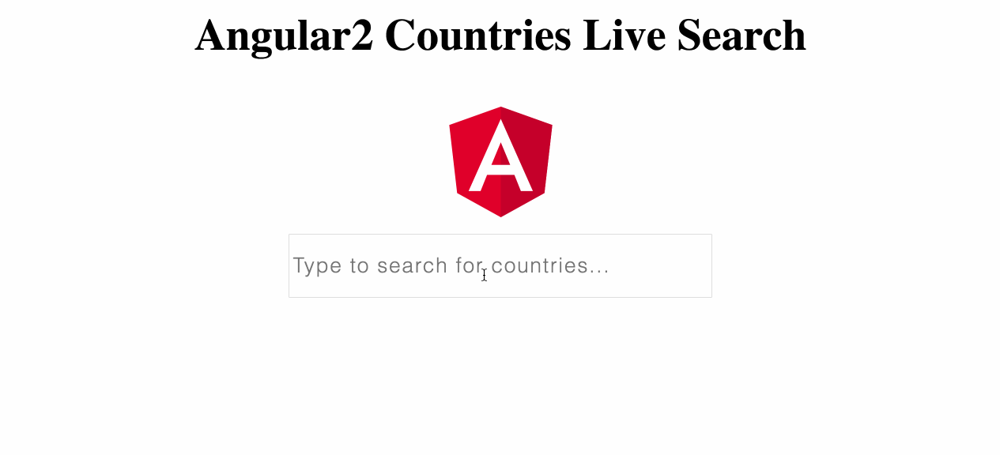

# LiveSearchAngular2
Angular4 web application to (live) search for countries. For every typed input/ added character, a new service call is made thus not needing to load all the data before hand. It also features some basic select and unselect.

## Setup
1. Clone/Download/Fork project.
2. Run `npm install` in the root folder of the project.
3. Run `npm start` in the root folder of the project.
4. Open http://localhost:4200/
